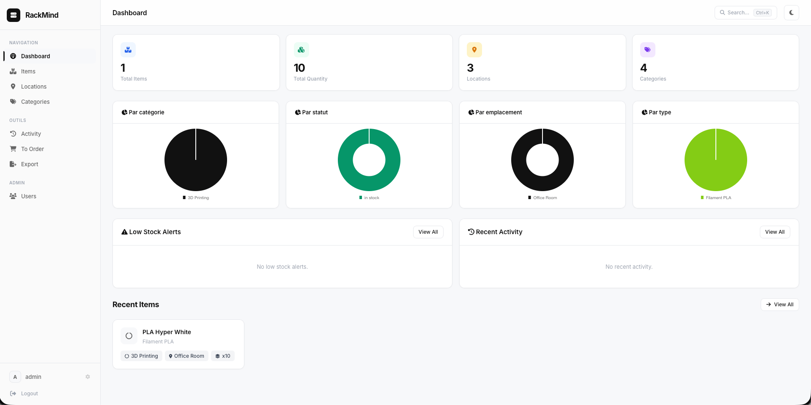

# RackMind

Systeme de gestion d'inventaire pour le hardware IT, les composants electroniques, l'outillage et l'impression 3D.




---

## Fonctionnalites

- **Gestion d'inventaire** — Ajout, edition, suppression d'items avec descriptions, numeros de serie, specs et suivi de quantite
- **Multi-images** — Jusqu'a 5 Mo par image (JPEG, PNG, GIF, WebP)
- **QR Codes** — Generation automatique pour chaque item
- **Arborescence de lieux** — Emplacements hierarchiques (salles, etageres, tiroirs...)
- **Categories & types** — 4 categories et 60+ types d'items pre-configures
- **Tags & liens** — Categorisation flexible et relations entre items
- **Alertes stock bas** — Vue "A commander" avec seuils personnalisables
- **Roles & permissions** — Admin, Editeur, Lecteur
- **Journal d'activite** — Audit complet de toutes les actions
- **Export/Import** — JSON et CSV
- **API REST v1** — Pour integrations externes
- **Theme sombre/clair** — Interface responsive avec sidebar
- **Filtres sauvegardes** — Acces rapide aux recherches frequentes
- **Securite** — CSRF, rate limiting, sessions securisees, bcrypt

## Stack technique

| Composant | Technologie |
|-----------|------------|
| Backend | Node.js + Express |
| Base de donnees | MySQL 8.0 |
| Templates | EJS |
| Auth | bcryptjs + express-session |
| Securite | csrf-csrf, express-rate-limit, express-validator |
| Upload | Multer |
| QR Codes | qrcode |
| Conteneurisation | Docker + Docker Compose |

## Installation

### Deploiement rapide (image pre-construite)

Aucun build necessaire, l'image Docker est construite automatiquement par GitHub Actions.

```bash
mkdir rackmind && cd rackmind

# Telecharger le docker-compose de production
curl -O https://raw.githubusercontent.com/sn0walice/RackMind/main/docker-compose.prod.yml

# Lancer
docker compose -f docker-compose.prod.yml up -d
```

L'application est accessible sur `http://localhost:3000`.

> Pour personnaliser les identifiants, creer un fichier `.env` a cote du compose :
> ```env
> SESSION_SECRET=mon-secret-aleatoire
> DB_PASSWORD=mon-mdp-securise
> DB_ROOT_PASSWORD=mon-root-mdp
> DEFAULT_ADMIN_USER=admin
> DEFAULT_ADMIN_PASS=admin
> ```

### Build local avec Docker

```bash
git clone https://github.com/sn0walice/RackMind.git
cd RackMind
cp .env.example .env
docker compose up
```

### Sans Docker

**Pre-requis :** Node.js 20+, MySQL 8.0

```bash
git clone https://github.com/sn0walice/RackMind.git
cd RackMind
npm install
cp .env.example .env
# Configurer .env avec les infos de connexion MySQL
npm run migrate
npm run dev
```

## Configuration

Copier `.env.example` en `.env` et adapter :

```env
NODE_ENV=development
PORT=3000
SESSION_SECRET=change-me

DB_HOST=localhost
DB_PORT=3306
DB_USER=rackmind
DB_PASSWORD=rackmind_secret
DB_NAME=rackmind

DEFAULT_ADMIN_USER=admin
DEFAULT_ADMIN_PASS=admin
```

## Connexion par defaut

| Utilisateur | Mot de passe |
|------------|-------------|
| `admin` | `admin` |

> Le changement de mot de passe est impose a la premiere connexion.

## Scripts disponibles

| Commande | Description |
|----------|------------|
| `npm start` | Lancement en production |
| `npm run dev` | Lancement en dev (auto-reload) |
| `npm run migrate` | Execution des migrations |

## Structure du projet

```
RackMind/
├── src/
│   ├── app.js              # Point d'entree Express
│   ├── config/             # Connexion base de donnees
│   ├── middleware/          # Auth, flash messages
│   ├── models/             # Couche d'acces aux donnees
│   ├── routes/             # Routes & controleurs
│   ├── migrations/         # Schema SQL
│   ├── utils/              # Utilitaires
│   └── views/              # Templates EJS
├── public/
│   ├── css/                # Styles (themes clair/sombre)
│   ├── js/                 # JS client
│   └── images/uploads/     # Images uploadees
├── scripts/                # Script de migration
├── Dockerfile
├── docker-compose.yml
└── .env.example
```

## Screenshots

> *A venir*

## Licence

MIT
